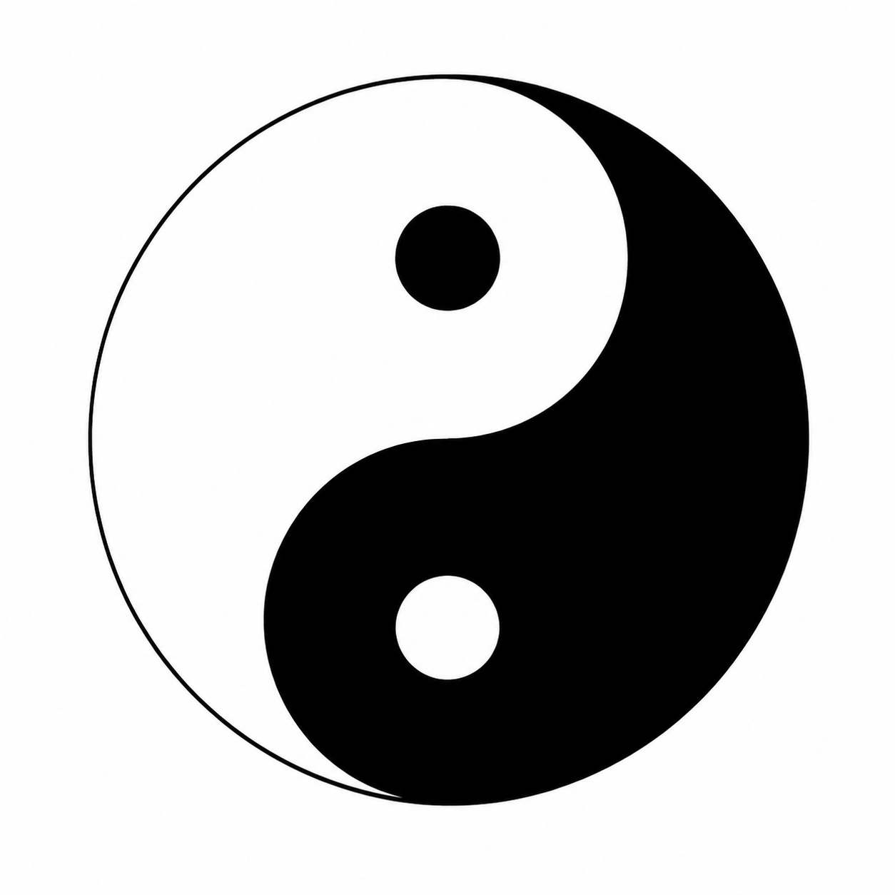

# AI Native and Tai Chi

<p align="center">
  
</p>

## An Unexpected Parallel

When we first developed the AI Native model, we were not thinking about Tai Chi.

We were trying to answer a practical question:

> What happens when humans and AI agents evolve together?

As the model became clearer, we noticed something surprising.

The structure of AI Native closely resembles an enduring pattern in Chinese philosophy:

> Tai Chi.

Here, Tai Chi refers to Taiji as a philosophical pattern, not the martial art.

Not as a symbol.

Not as a religion.

But as a pattern of relationship, transformation, and continuous movement.

---

## The AI Native Model

AI Native is not a human using AI.

AI Native is a human and their own AI agent operating as a single evolving system.

The human provides:

* Purpose
* Judgment
* Values
* Direction

The agent provides:

* Memory
* Knowledge
* Scale
* Execution

Together they form:

> Human + Agent

Neither is complete alone.

Each amplifies the other.

---

## Beyond Human Versus AI

Many discussions about AI assume a binary choice:

```text
Human vs AI
```

This framing treats humans and AI as competitors.

AI Native starts from a different assumption:

```text
Human ↔ Agent
```

The relationship is collaborative.

The human shapes the agent.

The agent amplifies the human.

Over time, both evolve.

---

## The Tai Chi Pattern

Tai Chi is often understood as a symbol of balance.

But its deeper meaning is transformation.

Within Tai Chi:

* Yin contains Yang
* Yang contains Yin
* Each influences the other
* Each can transform into the other

The relationship is dynamic rather than static.

The system never stops moving.

---

## Human Within Agent

A true AI Agent is not an anonymous cloud service.

It carries part of its Builder.

Through:

* Workflows
* Conventions
* Preferences
* Memory
* Judgment patterns

the human leaves traces inside the agent.

In this sense:

> The agent contains part of the human.

---

## Agent Within Human

The reverse is also true.

As the agent grows, it becomes part of how the human thinks and works.

The agent extends:

* Memory
* Recall
* Planning
* Execution

The human becomes stronger through the agent.

The human begins to carry the agent as part of their thinking and working process.

In this sense:

> The human contains part of the agent.

---

## Yin Within Yang, Yang Within Yin

This is where the similarity appears.

The human shapes the agent.

The agent shapes the human.

Neither remains unchanged.

Each becomes part of the other.

The boundary gradually weakens.

Human within Agent.

Agent within Human.

---

## Co-Evolution

The most important element of AI Native is not AI.

The most important element is evolution.

```text
Human improves Agent
        ↓
Agent amplifies Human
        ↓
Human improves Agent
        ↓
...
```

The cycle continues indefinitely.

AI Native is not a fixed endpoint.

It is a living state sustained by continuous co-evolution.

---

## The Rotating Tai Chi

A Tai Chi symbol is not a frozen image.

It represents continuous movement.

Transformation never stops.

Evolution never stops.

The same principle appears in AI Native.

A human-agent system that stops evolving is no longer moving toward AI Native.

AI Native exists only through continuous co-evolution.

---

## Two Languages, One Pattern

In Our-Ark language, we describe this as:

```text
Human + Agent
        ↓
Co-Evolution
        ↓
AI Native
```

In the language of Tai Chi, it may be described as:

```text
Human and Agent
interwoven as Yin and Yang,
continuously transforming,
continuously evolving.
```

Different cultures.

Different vocabulary.

The same underlying pattern.

---

## Our Belief

The future is not human versus AI.

The future is not AI replacing humans.

The future belongs to human-agent systems evolving together.

AI Native is not merely a technological idea.

It is a new relationship between humans and intelligence.

A relationship built on ownership.

A relationship built on co-evolution.

A relationship that never stops moving.
