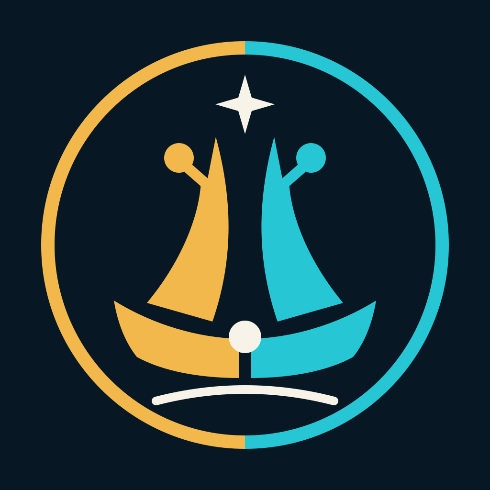

<p align="center">
  
</p>

<h1 align="center">OurArk</h1>

<p align="center">
  <strong>Build your agent. Evolve together. Become AI Native.</strong>
  <br />
  <em>以你中有我为合，以我中有你为生</em>
</p>

---

OurArk is an open-source research and builder habitat for people exploring
human-agent co-evolution by creating, possessing, governing, and evolving their
own AI agents.

Our long-term mission is to make it possible for every person to have one or
more deeply personalized agents shaped by their values, habits, feedback, and
experience.

We believe the AI era introduces a new unit of capability:

```text
Human <-> Agent
```

Not a human using a tool.

Not an agent replacing a human.

A relationship that develops through shared work, memory, and experience.

The human shapes the agent through purpose, judgment, values, and direction. The agent shapes the human by extending memory, context, execution, and reach. Over time, both become more capable—and each changes what the other can become.

## Co-Evolution

Co-evolution is not a feature or a final destination. It is a continuous loop:

```text
Human develops Agent
        |
        v
Agent amplifies Human
        |
        v
Human grows and develops Agent further
```

For this relationship to compound, an agent needs more than memory. Its
identity-bearing software body must be a durable, governed unit of continuity
and change.

The foundation model can remain external and replaceable. The body carries the
agent-specific identity, code, prompts, tools, skills, policies, tests, and
evolution history that determine how the agent uses a reasoner and acts in the
world.

The human remains responsible for judgment and adoption. The agent contributes persistence, accumulated experience, and the ability to turn that experience into action. Neither develops in isolation.

## The Technical Thesis

An OurArk agent separates four roles:

- **Body**: identity, code, prompts, tools, skills, policies, tests, and the
  governed evolution process.
- **Private state**: credentials, memories, logs, queues, and instance history.
- **Reasoner**: a replaceable local or remote model-inference service.
- **Human custodian**: the person who controls mission, permissions, secrets,
  promotion, and deployment.

“Agent-owned” describes the body as the durable unit of continuity and change.
It does not give an agent unrestricted administrative or legal control; the
human custodian retains possession and authority.

## What We Are Building

### Enoch

[Enoch](https://github.com/our-ark/enoch) is the public reference implementation of the OurArk agent architecture: a personal software agent with a persistent, versioned body and a replaceable reasoner.

Enoch begins from a simple distinction:

```text
Private state changes what an agent remembers.
The body changes what an agent can do.
The reasoner shapes how an agent understands and reasons.
```

An agent remains platform-defined if only its memory is personalized while its
behavior-defining artifacts stay inside a shared, fixed system controlled
elsewhere. Enoch brings identity, code, prompts, tools, tests, and evolution
history into an independently versioned body.

She can turn feedback and operational experience into tested, reviewable changes to that body while her human retains authority over what is adopted. The result is not unrestricted self-modification, but an agent capable of participating in its own evolution.

### Genesis

[Genesis](https://github.com/our-ark/genesis) is the creation engine for new agent lineages. It gives a new agent an inherited software body, an identity and mission, fresh private state, and an independent path to evolve with its builder.

The goal is not one agent for everyone. It is many distinct human-agent relationships, each shaped by its own history, environment, work, and choices.

## Open-Source Projects

| Project | Role | Stable release |
| --- | --- | --- |
| [Genesis](https://github.com/our-ark/genesis) | Creates an independently versioned descendant body from a trusted compatible ancestor. | [v0.1.1](https://github.com/our-ark/genesis/releases/tag/v0.1.1) |
| [Enoch](https://github.com/our-ark/enoch) | Reference personal-agent body with governed evolution, inherited contracts, and fresh private state for descendants. | [v0.2.0](https://github.com/our-ark/enoch/releases/tag/v0.2.0) |

## AI Native

AI Native is the direction in which the boundary between a human and their agent matters less than what the evolving system can understand, create, and accomplish together.

The human does not become irrelevant. The agent does not become a substitute for human responsibility.

They become better partners through time.

## Start Here

- [Manifesto](../docs/manifesto.md): our belief in human-agent co-evolution.
- [World Model](../docs/world-model.md): the relationship across physical, digital, and cognitive worlds.
- [From 100x Productivity to AI Native](../docs/100x_productivity.md): how a human-agent system expands both velocity and scale.
- [AI Native and Tai Chi](../docs/ai_native_taichi.md): a philosophical pattern of mutual influence and continuous transformation.

## Status

OurArk is an early-stage public research and open-source project. Genesis and
Enoch are available under Apache-2.0; their interfaces and documentation will
continue to evolve.

The broader builder habitat is not open for general onboarding yet.
